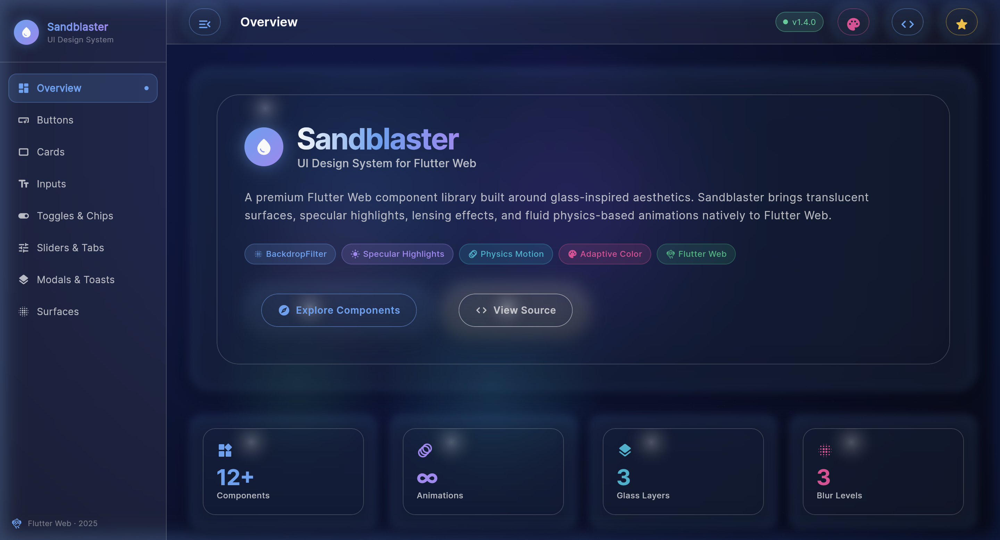
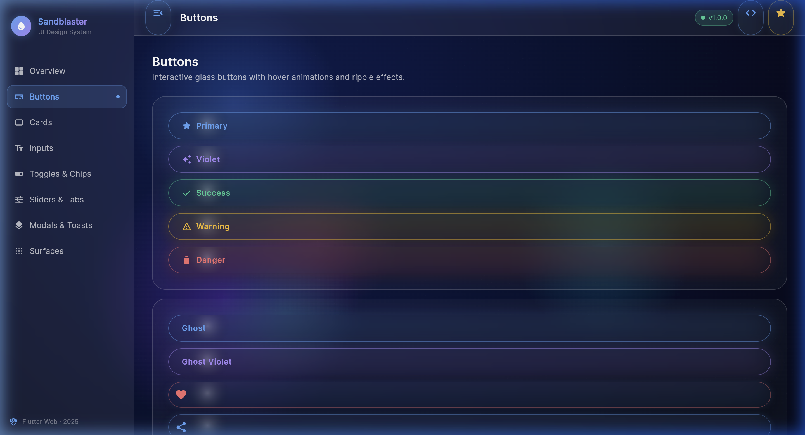
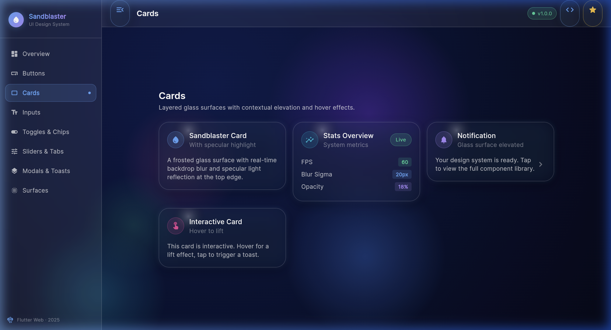
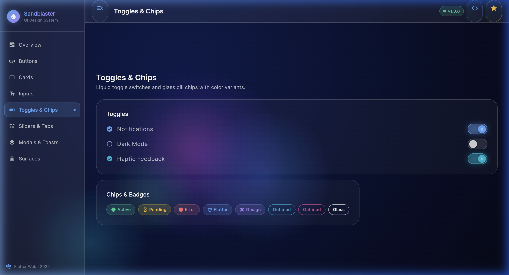
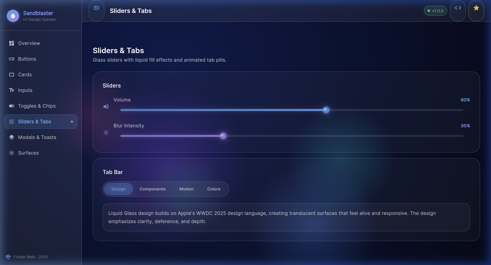
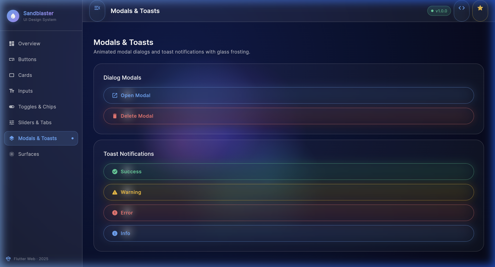
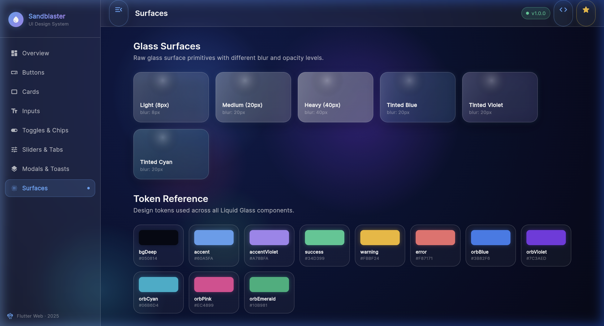

# Sandblaster UI 🪟🌊

A premium Flutter Web design system focused on glass-inspired aesthetics. Inspired by "Liquid Glass" design principles (WWDC 2025), Sandblaster brings translucent materials, real-time light refraction, and fluid physics-based animations to your Flutter applications.



## 🚀 Adoption Guide

If you have an existing Flutter app and want to adopt the Sandblaster design language, follow these steps:

### 1. Add Dependencies
Add the following to your `pubspec.yaml`:
```yaml
dependencies:
  google_fonts: ^6.2.1
  flutter_animate: ^4.5.0
```

### 2. Copy the Sandblaster Core
Copy the following directories from this repo into your project:
- `lib/theme/` (Design tokens and themes)
- `lib/widgets/` (Core primitives like `LiquidGlassContainer` and `AnimatedBackground`)
- `lib/components/` (All UI components)

### 3. Initialize the Theme
Wrap your `MaterialApp` with the `LiquidGlassTheme`:
```dart
import 'package:your_app/theme/liquid_glass_theme.dart';

MaterialApp(
  theme: LiquidGlassTheme.themeData,
  home: YourRootWidget(),
)
```

### 4. Add the Animated Background
For the full effect, wrap your screens in the `AnimatedBackground`:
```dart
import 'package:your_app/widgets/animated_background.dart';

Scaffold(
  body: AnimatedBackground(
    child: YourContent(),
  ),
)
```

### 5. Use Glass Components
Replace standard widgets with Sandblaster components:
```dart
import 'package:your_app/widgets/liquid_glass_container.dart';
import 'package:your_app/components/glass_button.dart';

LiquidGlassContainer(
  child: Column(
    children: [
      Text("Frosted Surface"),
      GlassButton(
        label: "Primary Action",
        onPressed: () {},
      ),
    ],
  ),
)
```

## 📸 Component Showcase

| Overview | Buttons |
|---|---|
|  |  |

| Cards | Inputs |
|---|---|
|  |  |

| Toggles & Chips | Sliders & Tabs |
|---|---|
|  |  |

| Modals & Toasts | Surfaces |
|---|---|
|  |  |

## 🛠 Features

- **LiquidGlassContainer**: Frosted glass surfaces with real-time backdrop blur, specular highlights (top-left arc), and mouse-tracking shimmer.
- **AnimatedBackground**: Smoothly moving gradient orbs using `CustomPainter` for high performance, with an optional grain texture overlay.
- **Physics Motion**: All animations use physics-based curves for a natural, premium feel.
- **Adaptive Color**: Components tint themselves based on the background, maintaining legibility while looking integrated.

---
*Built with Flutter Web · 2025*
